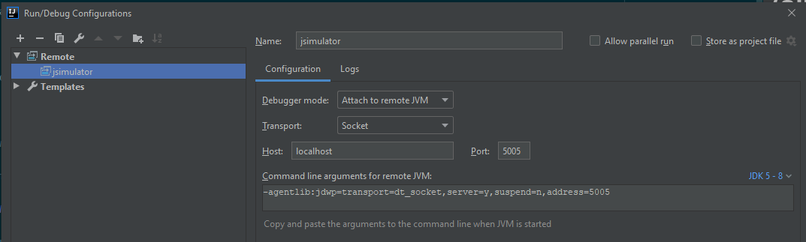
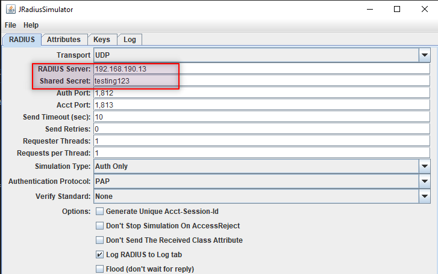
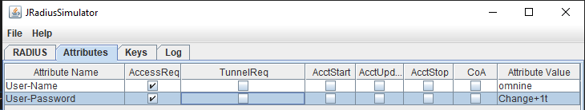
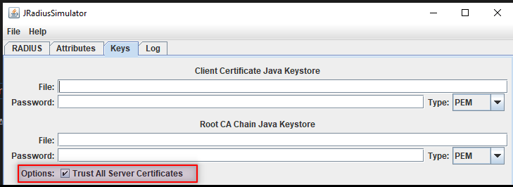

jradius
=======

JRadius is a Java RADIUS framework for client and server. 

# How to build

Run the package on the parent `pom.xml`

# How to Run the client (simulator)

Find the file `jradius-client-1.1.6-SNAPSHOT-release.zip` under `client\target`. Unzip it to some other folder.

Then run `simulator.cmd`, assume you have JAVA 1.8+ installed.

# How to Debug the client

Run the simulator in debug mode,
```aidl
java -cp ".;.\lib\*" -agentlib:jdwp=transport=dt_socket,server=y,suspend=n,address=5005 net.jradius.client.gui.JRadiusSimulator
```

Then use `IntelliJ` to attach it,


# Test
Basic Settings - Server and shared secret  
  
Attributes  


Wireshark traffic captures are provided for you convenience.

## PAP
[PAP protocol Wireshark traffic capture](./doc/radius-pap.pcapng)
## MSCHAPv2
[MSCHAPv2 protocol Wireshark traffic capture](./doc/radius-mschapv2.pcapng)
## EAP-MSCHAPv2
[EAP-MSCHAPv2 protocol Wireshark traffic capture](./doc/radius-eap-mschapv2.pcapng)
## PEAP (Inner MSCHAPv2)
Please tick this option just in case your server certificate is not trusted by default.


[PEAP inner MSCHAPv2 Wireshark traffic capture](./doc/radious-peap-mschapv2.pcapng)
